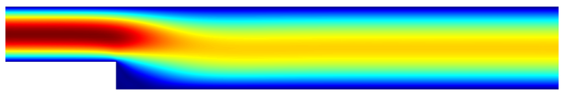

These are a Finite Difference, Finite Volume, and Finite Element Programs for the MIC-434 class at the Universidad Tecnica Federico Santa Maria.

Computational Fluid Dynamics in 2D (CDF_2D)
============================================

**CFD_2D** is a software for solving fluid dynamics problem in 2D. The format and code struture are presented in each assignment. The software covers:
    
* Linear operator for assembly and constraints
* Implementation of Finite Difference Method
* Implementation of Finite Volume Method
* Implementation of Finite Element Method
* Implementation of Steady and Dynamics analyses
* A well-balance piece-wise linear reconstruction
* Numerical integration for iso-parametric elements
    
Theory and Documentation 
========================
*Computational Fluid Dynamics*, Danilo S. Kusanovic, 2023.
